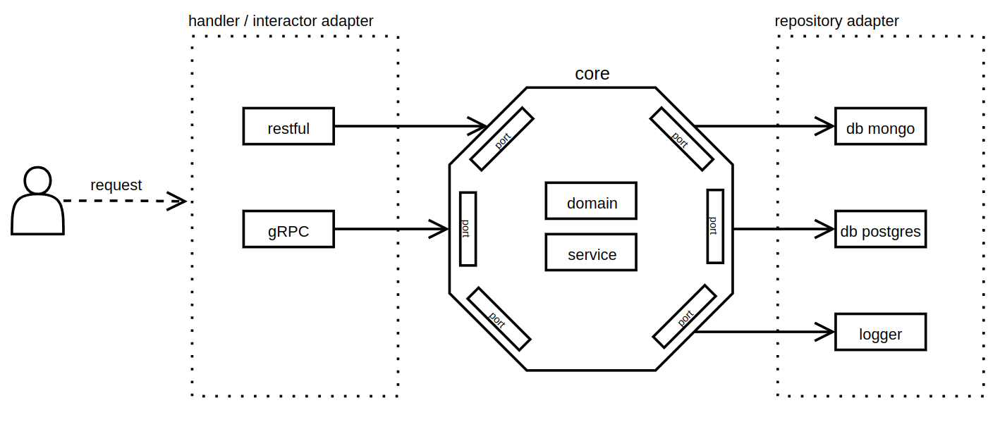

# 

> ### Golang Hexagonal Architecture codebase containing real world examples (CRUD, auth, advanced patterns, etc) that adheres to the [RealWorld](https://github.com/gothinkster/realworld) spec and API.


### [Demo](https://demo.realworld.io/)&nbsp;&nbsp;&nbsp;&nbsp;[RealWorld](https://github.com/gothinkster/realworld)


This codebase was created to demonstrate a fully fledged fullstack application built with Golang including CRUD operations, authentication, routing, pagination, and more.

We've gone to great lengths to adhere to the Golang community styleguides & best practices.

For more information on how to this works with other frontends/backends, head over to the [RealWorld](https://github.com/gothinkster/realworld) repo.


# How it works

The [hexagonal architecture](https://en.wikipedia.org/wiki/Hexagonal_architecture_(software)) is simply push any external dependency to the edge of the app and keep business logic (service) in the core part. With this architecture we can easily swap external dependencies such as swap restful API to gRPC, mongo to postgres etc. 

# Getting started
## Prerequisite 
- [docker](https://www.docker.com/)
- [docker compose](https://docs.docker.com/compose/) 
- [go](https://go.dev/) 


## Simple Mode
Run default app (rest-api, postgres) (see docker-compose.yaml)
```sh
$ docker compose --profile restful_postgres up -d

```
## Development Mode
1. Add environment
    ```
    cp env.example .env
    ```
1. Run all required external dependency for development (databases)
    ```sh
    $ docker compose up -d
    ```
1. Run the app
    ```sh
    $ go run main.go server
    ```
1. (optional) See help of application
    ```sh
    $ go run main.go server --help
    ```
1. (optional) run app with different dependency
    ```sh
    $ go run main.go server --server grpc --database mongo --log zap
    ```